# Blue Windows 7 - TryHackMe Room Walkthrough


---

| **Description:**  | _Deploy & hack into a Windows machine, leveraging common misconfigurations issues._ |
| ------------- | ------------- |
| **Level:**  | _Easy_   |
| **Approx Duration:**  | _30 minutes_  |
| **Author:**  | _@darkstar7471_  |

---

### Prerequisite

This is a free room in tryhackme, so you can start the attached atatckbox or use openvpn to connect to the target machine. 

For this writeup i will be using a kali machine and create a tunnel connection to the target machine using openvpn.

---

## Task 1 - ***Recon***

1. **Scan the machine**

    We use nmap to scan the target machine using below command:

    ```bash
    nmap 10.10.114.74 -sV -vv --script=vuln 
    ```

    -sV: To detect version number.

    -vv: Very verbose.

    --script=vuln: Uses NSE(nmap scripting engine) to scan for known vulnerabilites.


2. How many ports are open with a port number under 1000?

    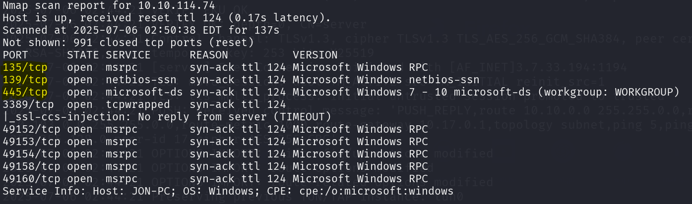

    The answer is `3` ports are open under 1000.

3. What is this machine vulnerable to?

    NSE enables nmap to scan the target machine against the known vulnerabilities using the flag `--script=vuln`.

    We can see the script results in the scan report as highlighted below:

    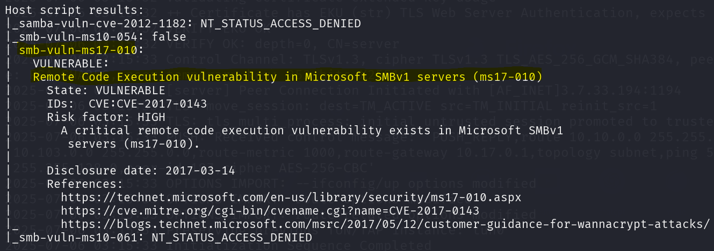

    From the scan result, we can understand that the machine is vulnerable to remote code execution vulnerability in microsoft SMBv1 servers - `ms17-010`.

---

## Task 2 - ***Gain Access***

Now that we have identified a high risk vulnerability in the target machine, our next task would be to exploit the found vulneability and ***gain remote access***.

To perform exploitation, we use `metasploit` tool, which is pre-installed on kali linux.

1. Start metasploit

    To start the metasploit simply use the command `msfconsole` in the terminal. (use `msfconsole -q` for quick launch)

    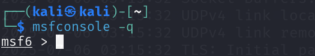


2. Find the exploitation code we will run against the machine. What is the full path of the code? 

    Use the `search` function in metasploit to search the database for the exploit code for our target machine.

    - `search ms17-010`

    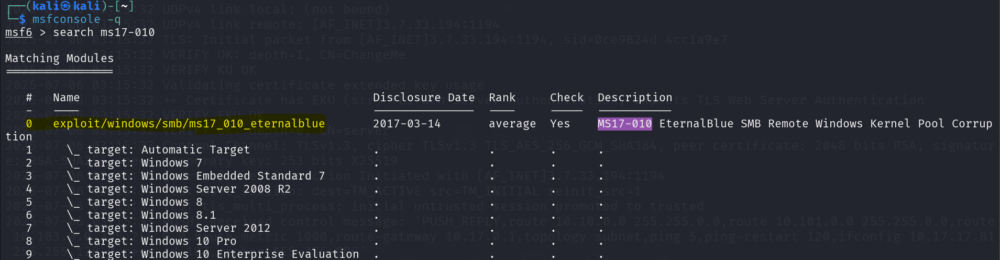

    we can see the full path to the exploit code highlighted in the above image.

    `exploit/windows/smb/ms17_010_eternalblue`.


3. Show options and set the one required value. What is the name of this value? 

    Once we have determined the exploit code, type the following command `use 0` which the index for the path or `use exploit/windows/smb/ms17_010_eternalblue' type the entrie path.

    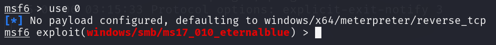

    To show options, simply type `options`.

    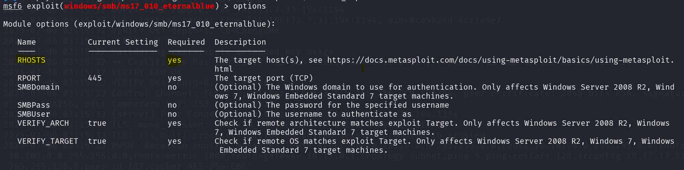

    The Required value that we need to set before running the exploit is `RHOSTS`.

    - We have to set the remote host value to our target machine ip.

    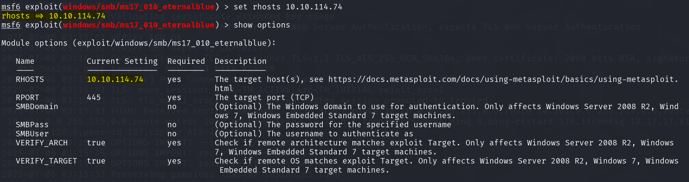

    - With that everything is set and ready to run the exploit, simply type the command `run` or `exploit`.

    This successfully created a meterpreted shell on the target system.

    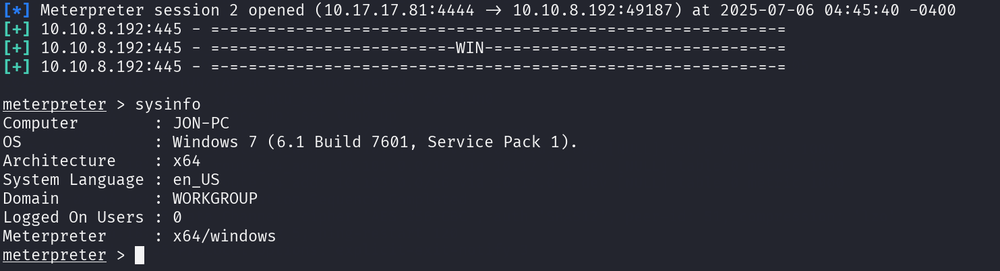


---

## Task 3 - ***Escalate***

Now that we have gained access to the target system using reverse shell exploit, It is time to escalate the privilege we have on the target to access sensitiev files.

1. To convert a shell to meterpreter shell in metasploit. What is the name of the post module we will use?

    We need to upgrade the shell to meterpreter shell, this can be done with the command `shell_to_meterpreter`, however we cannot use this directly, google and find appropiate module name.

    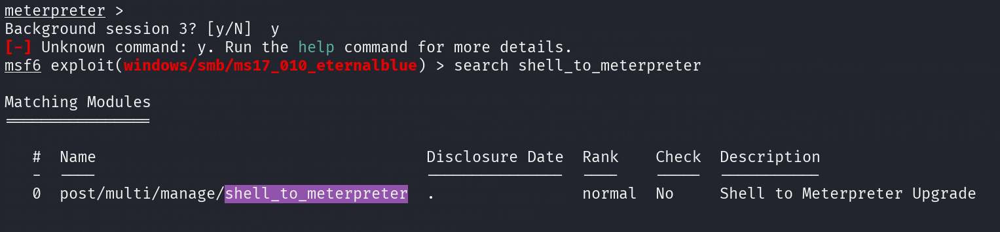

2. Select this (use MODULE_PATH). Show options, what option are we required to change?

    Find `sessions` information and set session accordingly.

    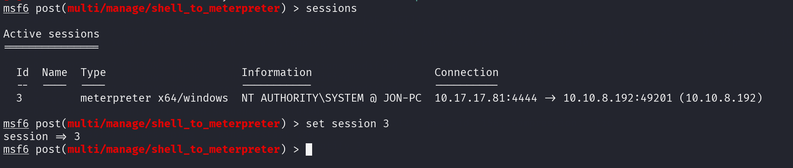

3. Everything is set, now we can run our exploit.

    After exploiting phase, it will create a new session, in my case session id 4.

    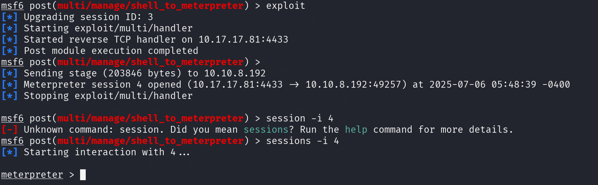

    Now we need ensure that we have system level privelege in this new session.

    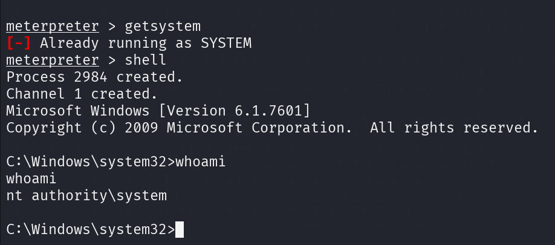

    we have verified that we have escalated to NT AUTHORITY\SYSTEM. 

4. We have verified that we have system level access, we need to find process running in the system. Background the current session, go the meterpreter shell and use command `ps` to list all process running.

    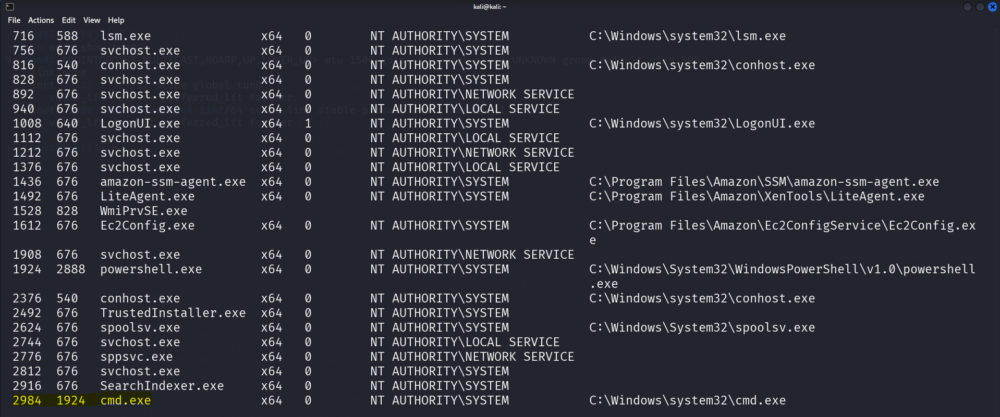

    Look for process that run cmd or powershell.

5. Migrate to this process using the 'migrate PROCESS_ID' command.


---

## Task4: ***Cracking***

Once we have completed migrating we will have higher privelege, we can perform `hashdump` to retrieve passwords stored in the system.

---
