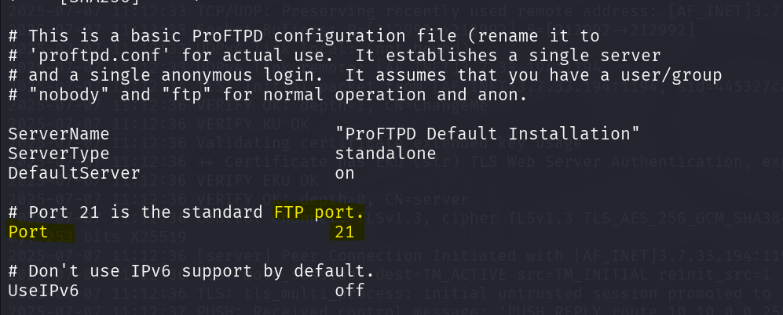

# Kenobi - TryHackMe Room Walkthrough


---

| **Description:**  | _This room will cover accessing a Samba share, manipulating a vulnerable version of proftpd to gain initial access and escalate your privileges to root via an SUID binary._ |
| ------------- | ------------- |
| **Level:**  | _Easy_   |
| **Approx Duration:**  | _45 minutes_  |
| **Author:**  | _tryhackme_  |
| **Path:**  | _Offensive Penetration Testing_  |

---

## Task 1

    Start the machine attached to this room and connect to the newtork of the target machine via atatckbox or openvpn.

    For this walkthrough i will be using kali linux and openvpn to create a tunnel to the target network.

1. Do a basic nmap scan and see how many ports are open?

    

    From nmap scan, we can see that `7` ports are open and their services that is running on these ports.


## Task 2

Samba allows end users to access and use files, printers and other commonly shared resources on a companies intranet or internet. Its often referred to as a network file system.

Samba is based on the common client/server protocol of Server Message Block (SMB).

Using nmap to enumerate a machine for SMB shares.

`nmap -p 445 --script=smb-enum-shares.nse,smb-enum-users.nse 10.10.138.9`


The above nmap script has enumerates `3` smb shares on the port 445.

use the following `smbclient` to connect to one of the shares we found.

```
smbclient //10.10.138.9/anonymous
```

list the files on the share. What is the file can you see?


We can see a log text file `log.txt`.

Download the log.txt file using `get log.txt`. Read the log file and look for the port number in which ftp is running.



Run the below nmap script to enumerate further:

```
nmap -p 111 --script=nfs-ls,nfs-statfs,nfs-showmount 10.10.138.9
```


---

## Task 3 - Gain Initial access with ProFtpd

ProFtpd is a free and open source ftp server available in unix and windows system. 

Using netcat listener to connect to the default ftp port 21.

```
nc 10.10.1.68 21
```

This should return the version of the ProFtpd.


To search and find the exploit available for this version of ProFTPd, we can use `searchsploit` which eventually queries the exploit-db and returns the result.

```
searchsploit ProFTPd 1.3.5
```


Quick google about the exploit module mod_copy revealed the following information.


    This module exploits the SITE CPFR/CPTO mod_copy commands in ProFTPD version 1.3.5.
    Any unauthenticated client can leverage these commands to copy files from any part of the filesystem to a chosen destination.

use the following set of command to successfully copy the ssh id from server.


SITE CPFR - Command take the location of the file (copy from)
SITE CPTO - takes the path to paste the copied file (copy to)

We have found that `/var` is mountable in the server from the previous tasks, so we can paste the copied file in /var.

Mount the copied directory to our deployed machine.


As you can you see it has listed `tmp` folder.

copying the mounted file and chmod to read access.


---

## Task 4: Privilege Escalation with Path Variable Manipulation

SUID bit - User executes the file with permissions of the file owner.

SGID bit - User executes the file with the permission of the group owner/File created in directory gets the same group owner.

Sticky Bit - Users are prevented from deleting files from other users.


Search the system for files and directories where SUID bit is set.

```
find / -perm -u=s -type f 2>/dev/null
```


What folder looks out of the ordinary?

`/usr/bin/menu`


We have `3` options by running the binary /usr/bin/menu.


The folder has SUID bit set, which mean we can execute the file with the permission of the file owner.

use the following command.

```
strings /usr/bin/menu
```

Strings is a command on Linux that finds and prints text strings embedded in binary files.

Running the strings command on the /usr/bin/menu binary we can see that this is running without a full path.


We can copy the /bin/sh shell into a file named curl, then change the permissions of the file to be readable, writeable and executable for all users. Finally, we can add the location of our curl file containing the shell to the system path.


We no have root access in our target machine. All that is left to do is to garb the flag from `/root/root.txt`.


This room is now completed.

---