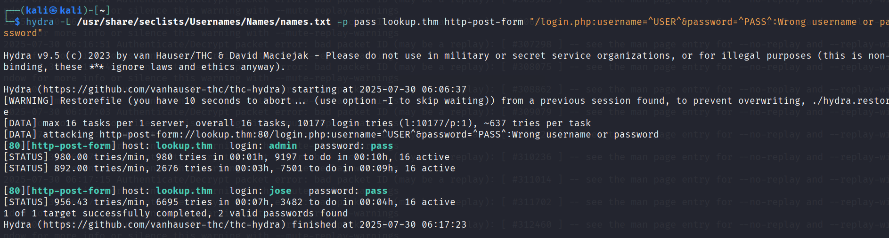
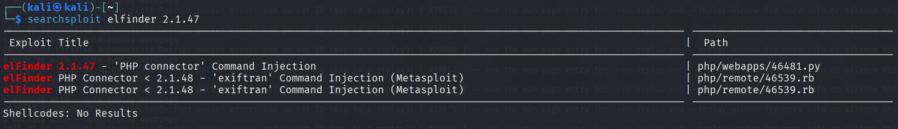

# Lookup - TryHackMe CTF Walkthrough
---

| **Description:**  | _Lookup: Test your enumeration skills on this boot-to-root machine._ |
| ------------- | ------------- |
| **Level:**  | _Easy_   |
| **Approx Duration:**  | _60 minutes_  |
| **Author:**  | _josemlwdf_  |
| **Path:**  | _Penetration Testing - Enumeration_  |
| **Type:**  | _Free Room_  |

---

https://tryhackme.com/room/lookup

Pre-requisite: Boot up the target machine attached to this room and also boot up kali linux and create a tunnel connection to the target machine via openvpn.


Lookup offers a treasure trove of learning opportunities for aspiring hackers. This intriguing machine showcases various real-world vulnerabilities, ranging from web application weaknesses to privilege escalation techniques. By exploring and exploiting these vulnerabilities, hackers can sharpen their skills and gain invaluable experience in ethical hacking. Through "Lookup," hackers can master the art of reconnaissance, scanning, and enumeration to uncover hidden services and subdomains. They will learn how to exploit web application vulnerabilities, such as command injection, and understand the significance of secure coding practices. The machine also challenges hackers to automate tasks, demonstrating the power of scripting in penetration testing.

---

Phase 1:

Once the target machine is booted up, and made sure we are able to ping from out kali linux using openvpn. 
We can start recon on the machine using nmap.

```
nmap 10.10.108.154 -Pn -sV -A 
```


Using nmap for intial engagement we have found some information related to number of ports open on target machine, OS details of the machine and the services running on the open ports.

We can use this information to enumerate futher.

From the nmap scan we identified on the default port 80 is apache httpd webserver, which is redirected to `http:\\lookup.thm`.

To visit this webpage, we need to resolve this dns to our target-ip in our kali machine /etc/hosts.

```
sudo nano /etc/hosts/
```


Once this is resolved, visit `http:lookup.thm` in the browser.


Good, We now have found a login page.

I tried to brute force this login page using burp suite manually to find any vulnerability in login form.

At first i tried to capture the login request in burp suite using ***username:test and Password:test***.


We can that the response is "Username or Password is wrong"

On second try, I used ***username:admin and Password:admin***.


Here we get a different response, saying ***Password is Wrong***. Which is very different from initial response which indiactes that Username is `admin`.

With this information we can use `hydra` to enumerate valid usernames using hydra. For this enumeration we will need a wordlist, I used a common names wordlist from `SecLists`.

```
hydra -L /usr/share/seclists/Usernames/Names/names.txt -p pass lookup.thm http-post-form "/login.php:username=^USER^&password=^PASS^:Wrong username or password"
```

We are using a dummy password `pass` for the sake of username enumeration. 



We have identified 2 valid username: `admin` and `jose`.

Using hydra again, this time we brute force on the password field with found username.

```
hydra -l jose -P /usr/share/wordlists/rockyou.txt lookup.thm http-post-form "/login.php:username=^USER^&password=^PASS^:Wrong password" 
```

Hydra has found a password for both users. 


Let's use this credentials on the login form.


Credentials did not work in our favor but we got a clue.
This has enumerated a subdomain `files.lookup.thm`. We need to add this subdomain to the `/etc/hosts`.


Look like we have have landed in a file manager page of sorts. I looked around all the files in there and few details caught my attention.


We have a set of username and password, In nmap scan we found that this machine has ssh hosted on port 22. This credentials be of a ssh user.


We have version and basic details of the file manager software, we can look into any known vulnerability/exploits on metasploit.



We have found an already existing exploit on searchsploit for this version of the software.

Now, Lets boot up metasploit using `msfconsole`.


We have a exploit, before running this set RHOSTS and LHOST parameters.


Once all the required parameters are set run the exploit and create a meterpreter shell.


Now, we have a shell with basic access. We need to escalte our privelege.


Think user has a file `user.txt` which has the falg that we need. 


But for now we cannot read this file as we do not have any access.

To escalte privilege lets try to if any SUID bit has been set.


pwm is not a standard Linux binary. It does not exist by default on Debian/Ubuntu/CentOS.
Its location (/usr/sbin) and name suggest it’s a custom or third-party tool.

Since it has the SUID bit set and is not a common binary, it’s very likely a custom SUID binary added intentionally


It runs with the permissions of its owner and group, likely root:root. SUID confirmed.

I tried running `/usr/sbin/pwm`.

Boom — we’ve hit the jackpot. That higlighted message tells us exactly how the binary works, and it likely opens up an easy privilege escalation path.

With this we can trick the binary execution with different ID, for this we try a method called path hijacking.

default path that is used for execution is:

```
/usr/local/sbin:/usr/local/bin:/usr/sbin:/usr/bin:/sbin:/bin
```


Create a /tmp/id for crafting a id that we will force the binary to execute with.


Now that we have list of password list, save this list to our kali machine. use hydra to brute force with this list of password.

```
hydra -l think -P password.txt ssh://lookup.thm
```


Login into think ssh using the found password.


List files under this user.


We can cat out the `user.txt`.

Now, Once again we need to do a privilege escaltion to root access.

First lets see what sudo access does user think have.


The look command displays lines from a file that begin with a given string. 


We have ssh private key, lets save this key in kali linux.


Boom! We have root access. Cat out the flag.


This CTF challenege is now completed.
---